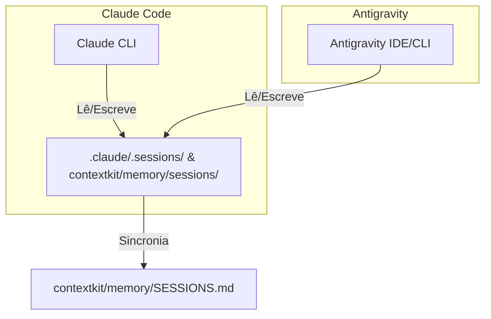

# Integração e Especificações do Antigravity

Este documento descreve as especificações técnicas, a arquitetura e a integração do **ContextDevKit** com a plataforma **Antigravity**. Ele detalha como a infraestrutura projetada originalmente para o Claude Code foi estendida de forma transparente para coexistir e funcionar nativamente com o agente Antigravity.

---

## 1. Visão Geral

A integração com o Antigravity foi projetada sob o princípio de **100% de paridade de recursos e zero interferência**. Isso significa que:
1. Todas as capacidades do ContextDevKit (slash commands, sub-agentes, playbooks e workflows) estão disponíveis no Antigravity.
2. O funcionamento do Claude Code não sofreu nenhuma alteração, permitindo o uso simultâneo de ambas as ferramentas no mesmo projeto sem divergência de estado.

---

## 2. Estrutura de Diretórios (.antigravity/)

Durante a instalação ou atualização do ContextDevKit, uma pasta oculta `.antigravity/` é criada na raiz do repositório contendo a versão adaptada dos recursos do kit para o Antigravity:

```text
your-project/
  .antigravity/
    skills/         # 105 Skills convertidas (anteriormente slash commands)
    agents/         # 34 Personas/Sub-agentes configurados
    playbooks/      # 7 Playbooks de engenharia de software
    workflows/      # 6 Workflows de ciclo de vida do DevPipeline
```

### Skills (`.antigravity/skills/`)
Os slash commands originais do Claude Code são documentos Markdown simples. Para o Antigravity, esses arquivos foram convertidos para o formato de **Skills**, onde o frontmatter e os blocos de instruções são adaptados para a engine de habilidades do agente.
* **Resolução de Caminhos:** O runner do Antigravity processa as chamadas de skill de forma idêntica à do Claude Code.
* **Índice Taxonômico:** O índice completo de skills e seu mapeamento por pacotes (QA, Audit, Pipeline, VCS, Forge, Setup, etc.) está documentado no Knowledge Item **contextdevkit-skills-index**.

### Personas (`.antigravity/agents/`)
Os sub-agentes especialistas de squads (como `devteam`, `qa-team`, `design-team` etc.) são expostos como **Personas** dentro de `.antigravity/agents/`. Cada persona contém instruções focadas de sistema que ensinam o agente a agir conforme o papel designado (ex: `seo-specialist`, `landing-architect`).

---

## 3. Runner Central de CLI (`ctx.mjs` / `agy`)

Para simplificar a execução dos 61 scripts do motor do ContextDevKit localizados em `contextkit/tools/scripts/`, foi introduzido o runner unificado **[ctx.mjs](../ctx.mjs)**.

### Atalhos e Execução
O runner pode ser acionado por meio de scripts do npm ou chamadas diretas ao binário global `agy`:

* **Atalho local via npm:**
  ```bash
  npm run ctx <comando>
  # ou
  npm run agy <comando>
  ```
* **Comando global (`agy`):**
  Definido no `package.json` através do mapeamento `"bin": { "agy": "ctx.mjs" }`. Após publicação ou linkagem local (`npm link`), pode ser usado diretamente:
  ```bash
  agy <comando>
  ```

### Funcionalidades do Runner
* **Busca Aproximada (Fuzzy Matching):** Se você digitar `agy reindex`, o runner localiza automaticamente `contextkit/tools/scripts/session-reindex.mjs`.
* **Ajuda Integrada e Listagem:** Executar `agy` ou `agy --help` lista todos os 61 comandos organizados por categorias (Core, VCS, QA, Pipeline, Audit, Forge, Setup, etc.) com suas respectivas descrições e caminhos.
* **Resolução Inteligente de Parâmetros:** Passa todos os argumentos extras diretamente para o script final.

---

## 4. Gerenciamento de Sessão (`session-manager.mjs`)

O ciclo de vida das sessões no Antigravity é controlado pelo script [session-manager.mjs](../contextkit/runtime/antigravity/session-manager.mjs).

### Ciclo de Trabalho
1. **`agy session start`:** Executa o gancho de boot (`boot-context.mjs`), que lê a configuração do projeto, inicializa o arquivo de sessão em `contextkit/memory/sessions/` e extrai o contexto atual do git.
2. **`agy session status`:** Verifica os arquivos editados e o ledger de drift local para identificar se há modificações que ainda não foram documentadas ou registradas na sessão ativa.
3. **`agy session end`:** Valida regras do projeto (como arquivos não rastreados de forma inadequada), fecha formalmente a sessão e dispara o script `session-reindex.mjs` para reconstruir o índice de sessões do projeto.

---

## 5. Coexistência com Claude Code

Uma das premissas fundamentais da integração é a **Coexistência Pacífica**. Claude Code e Antigravity compartilham exatamente os mesmos dados de memória de projeto e infraestrutura técnica:



* **Sem Conflitos de Estado:** Ambos os sistemas usam o mesmo ledger de detecção de drift. Uma alteração iniciada no Claude Code e continuada no Antigravity não gerará avisos de drift incompatíveis, mantendo o histórico de desenvolvimento linear.
* **Configuração Não Intrusiva:** O instalador [install.mjs](../install.mjs) injeta ganchos independentes para o Antigravity sem alterar os arquivos `.claude/settings.json` dedicados ao Claude Code.

---

## 6. Portabilidade e Regra Estática (Rule 4)

De acordo com a **Constituição de Código do ContextDevKit**, os scripts e ganchos em templates não devem possuir caminhos hardcoded para o diretório `contextkit/`.

Para garantir que a verificação estática do [selfcheck.mjs](../tools/selfcheck.mjs) passe com sucesso, todos os scripts do Antigravity importam caminhos configurados dinamicamente a partir de um utilitário de caminhos comuns:

```javascript
import { PLATFORM_DIR } from '../config/paths.mjs';
// O PLATFORM_DIR resolve dinamicamente para o diretório de instalação ativo,
// evitando strings estáticas proibidas no código-fonte dos templates.
```

---

## 7. Instalação e Atualização

Quando o instalador `install.mjs` é executado com a flag de instalação (`--target`) ou atualização (`--update`):
1. **Instalação do Runner:** O arquivo `ctx.mjs` é copiado para a raiz do projeto alvo.
2. **Cópia de Recursos:** A pasta `.antigravity/` é copiada de forma recursiva para a raiz do projeto.
3. **Patching de `package.json`:** O instalador lê o `package.json` do projeto de destino e insere as chaves `"ctx"` e `"agy"` na seção `scripts`, além de registrar a propriedade `bin` se necessário.
4. **Instruções Personalizadas:** Cria ou atualiza o arquivo `INSTRUCTIONS.md` com base no template `INSTRUCTIONS.md.tpl`, detalhando o uso do Antigravity específico para aquele repositório.
