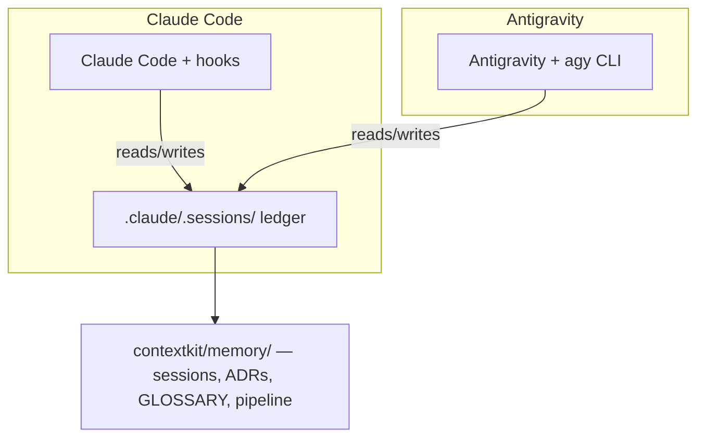

# Antigravity Integration — Architecture & Specification

How ContextDevKit runs natively in **Google Antigravity** alongside Claude Code —
same engine, same memory, zero drift between the two hosts.
Decision record: [ADR-0036](../contextkit/memory/decisions/0036-antigravity-second-native-host.md)
(host) and [ADR-0037](../contextkit/memory/decisions/0037-host-modular-installer.md)
(host-modular installer).

---

## 1. Overview

The integration follows two principles:

1. **Feature parity.** Every ContextDevKit capability — slash commands,
   sub-agents, playbooks, workflows, the L5 governance gate — has an Antigravity
   equivalent.
2. **Zero interference.** Claude Code's surface (`.claude/`, hooks,
   `CLAUDE.md`) is untouched; both hosts can be used in the same project
   simultaneously without state divergence.

Both hosts now enforce governance **automatically via hooks** (ADR-0049):
Claude Code through `.claude/settings.json`, agy through `.agents/hooks.json`
(SessionStart, PostToolUse, PreToolUse, Stop — same scripts, one host-adapter
seam). The **explicit CLI checkpoints** (`agy session …`, `agy guard`) remain
as belt-and-braces for hook-less agy versions and on-demand checks.

## 2. What gets installed

```text
your-project/
  INSTRUCTIONS.md     # Antigravity boot context (the host's CLAUDE.md)
  ctx.mjs             # central CLI runner (also exposed as the `agy` bin)
  .agents/
    skills/           # 73 skills — the slash commands, converted (same names)
    agents/           # 32 personas — the sub-agent archetypes
    playbooks/        # 7 reusable engineering procedures
    workflows/        # 6 level lifecycle guides (L1–L5 + README)
    hooks.json        # native agy lifecycle hooks, composed per level (ADR-0049)
```

The installer also patches the target `package.json` with `"ctx"`/`"agy"` script
shortcuts (silent no-op when there is no package.json).

### Skills (`.agents/skills/`)

Claude Code slash commands converted to Antigravity **skills**: frontmatter
stripped into a header, `$ARGUMENTS` and `.claude/` paths adapted, same domain
taxonomy (`audit/`, `pipeline/`, `qa/`, `vcs/`, `forge/`, `setup/`). Invoke by
name — "run the `audit` skill".

### Personas (`.agents/agents/`)

The squad sub-agents (devteam, qa-team, design-team, security-team,
compliance-team, ops-team, agent-forge) exposed as **personas**: focused system
instructions the agent adopts on demand (e.g. `seo-specialist`,
`landing-architect`).

## 3. The `ctx.mjs` / `agy` runner

Antigravity has no slash commands, so the **runner** is the single entry point
to the 76 engine scripts under `contextkit/tools/scripts/`:

```bash
node ctx.mjs <command> [...args]   # always works
npm run agy <command>              # via the patched package.json shortcut
agy <command>                      # if contextdevkit is installed globally
```

Dispatch contract (tickets 089/090/096):

- **Exact names and declared aliases only** — there is deliberately no prefix
  guessing (`agy tech` does NOT silently run `tech-debt-scan.mjs`).
- **Did-you-mean** — an unknown command prints the closest 3 matches
  (substring, then Levenshtein) instead of dumping the full menu.
- **`agy help`** prints the categorised menu; **`agy help <command>`** prints a
  single-command card (description, category, alias, invocation). The menu
  registry lives in `contextkit/runtime/antigravity/ctx-menu.mjs`; the runner
  degrades to a minimal usage text when the engine is absent.
- **Path confinement** — a resolved script must live under
  `contextkit/tools/scripts/`; path-shaped commands are refused.

**Trust model:** like npm scripts or git hooks, the runner executes code from
the *current* project. Only run it inside a project you trust.

## 4. Session lifecycle (`session-manager.mjs`)

The lifecycle is wired natively in `.agents/hooks.json` (ADR-0049): the agy
`SessionStart` event runs `session-manager.mjs start` (which also mints the
stable session id in `.claude/.sessions/.agy-active.json` that the per-event
hooks share), and `Stop` runs `session-manager.mjs end`. The same three
commands stay available explicitly
([session-manager.mjs](../templates/contextkit/runtime/antigravity/session-manager.mjs)):

| Command | Hook event | What it does |
|---|---|---|
| `agy session start` | SessionStart | Runs `boot-context.mjs` (memory digest, branch, drift, unreleased changes) + prints the Antigravity process rules + mints the agy session id |
| `agy session status` | — | Pending drift, last session, unreleased changes |
| `agy session end` | Stop | Drift check before ending: register via the `log-session` skill, or confirm the work is discardable |

Drift detection uses the **same predicate as the Claude Code Stop hook**
(`pendingImportantPaths` from `runtime/hooks/ledger.mjs`, config-driven via
`ledger.important`) — the two hosts agree by construction on what counts as
unregistered work (ticket 092).

## 5. Governance parity — `agy guard`

The L5 high-risk gate fires automatically on both hosts: as the Claude Code
PreToolUse `simulate-gate` hook, and on agy via the same script registered in
`.agents/hooks.json` per write tool (`--host agy` makes it answer in the agy
dialect — `decision: "deny"`). The **explicit pre-edit checkpoint** remains
(ticket 095):

```bash
node ctx.mjs guard src/db/schema.ts
# exit 0 — allowed (below L5, not high-risk, or covered by /simulate-impact)
# exit 1 — blocked: run the simulate-impact skill first (refuse-by-default)
```

Both hosts share one gate definition (`matchHighRisk` in
`runtime/hooks/path-classification.mjs`) and one coverage source (the session
ledger's simulation records). `INSTRUCTIONS.md` instructs the agent to run the
guard before touching any `l5.highRiskPaths` entry.

### Known host gap — model-tier routing (ADR-0052)

Cost-tiered model routing is **Claude Code only**. Kit agents declare a
`model: haiku|sonnet|opus|inherit` tier in their Claude frontmatter (cheap models
execute, expensive models think — ADR-0052); agy exposes no per-agent or
per-dispatch model API the kit knows of, and `.agents/` personas are
frontmatter-less conversions, so agy runs its session model for everything.
Revisit when agy exposes per-dispatch model selection — the kit refuses to fake a
Gemini mapping it cannot enforce (rule 8).

## 6. Coexistence with Claude Code

Both hosts read and write the **same substrate**:



- One drift ledger: a session started in Claude Code and continued in
  Antigravity produces a single coherent history.
- The installer wires each host independently — `.claude/settings.json` is never
  touched by the Antigravity steps and vice versa.

## 7. Build pipeline — how the host stays in sync

`templates/antigravity/` is **generated** from the Claude sources by
[convert-all.mjs](../templates/contextkit/runtime/antigravity/convert-all.mjs)
(ticket 085):

```bash
npm run build:antigravity   # kit build step — clean-first regeneration
                            # templates/claude + templates/contextkit/workflows
                            # → templates/antigravity (top-level README.md kept)
```

- Run it whenever a command/agent/playbook changes. It is a **kit build/release
  step** — the user `install`/`--update` path only copies the generated tree.
- A selfcheck **parity drift-guard** (ticket 084) fails the build when
  `templates/antigravity` and `templates/claude` diverge (missing twins or
  orphans, both directions).
- Inside an installed project, the same script without `--templates` converts
  the project's own custom `.claude/commands` → `.agents/skills`.

## 8. Health check

`/context-doctor` (or `agy doctor`) is Antigravity-aware (ticket 086): it
verifies the runner, the package.json shortcuts, the four asset trees,
`INSTRUCTIONS.md`, and that no `{{TOKEN}}` placeholder survived rendering —
advisory-only, so a Claude-only project never fails doctor over the optional
host.

## 9. Portability (rule 4)

No Antigravity script hardcodes the platform folder: paths come from
`PLATFORM_DIR` / `pathsFor()` (`runtime/config/paths.mjs`), enforced by the
static selfcheck. The integration is covered end-to-end by
`tools/integration-test-antigravity.mjs` (dispatch contract, guard, drift
predicate, doctor) in the `npm test` chain.
